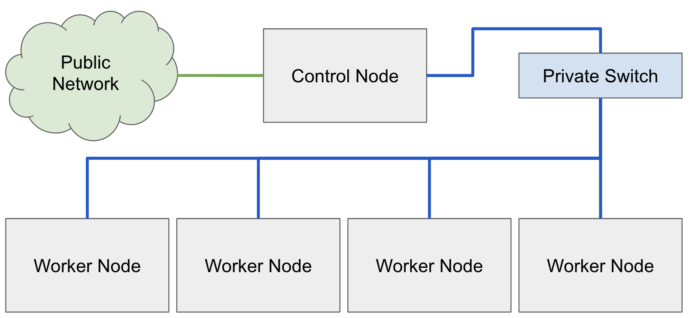

Warewulf is based on the design of the original Beowulf Cluster design (and thus the name, soft**WARE** implementation of the beo**WULF**)

The [Beowulf Cluster](https://en.wikipedia.org/wiki/Beowulf_cluster) design was developed in 1996 by Dr. Thomas Sterling and Dr. Donald Becker at NASA. The architecture is defined as a group of similar compute worker nodes all connected together using standard commodity equipment on a private network segment. The control node (historically referred to as the "master" or "head" node) is dual homed (has two network interface cards) with one of these network interface cards attached to the upstream public network and the other connected to a private network which connects to all of the compute worker nodes (as seen in the figure below).

This simple topology is the foundation for creating every scalable HPC cluster resource. Even today, almost 30 years after the inception of this architecture, this is the baseline architecture that traditional HPC systems are built to.

Other considerations for a working HPC-type cluster are storage, scheduling and resource management, monitoring, interactive systems, etc. For smaller systems, much of these requirements can be managed all from a single control node, but as the system scales, it may need to have groups of nodes dedicated to these different services.

Warewulf is easily capable of building simple and turnkey HPC clusters, to giant massive complex multi-purpose computing clusters, through next generation computing platforms.

Anytime a cluster of systems is needed, Warewulf is your tool!
